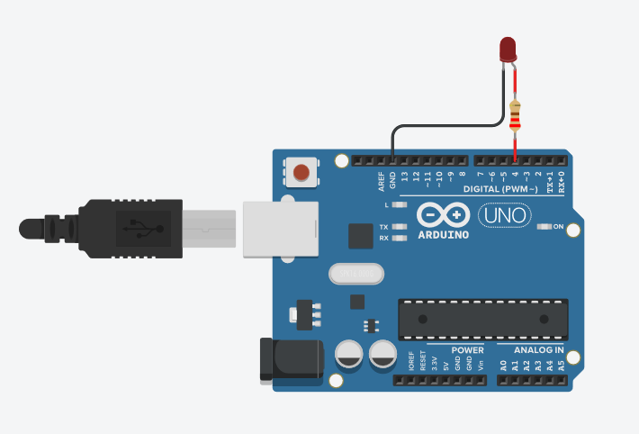

# Comandos Arduino
Esse material tem todos os comandos já usados durante o curso, além da sintaxe padrão da linguagem c/c++.

# Base para um código Arduino

```c
    void setup(){
        // A função setup() é o lugar onde você irá declarar suas variáveis, definir estado de pinos, definir o serial e etc.
    }
    void loop(){
        // A função loop() é onde você pode colocar seu código que irá ficar em loop, ou seja, se você está monitorando uma temperatura, ele irá monitorar até que o Arduino seja desligado
    }
```

# Serial

## Print e Begin
```c
    void setup(){
        Serial.begin(9600); // Inicia a comunicação serial do arduino com o computador em 9600 bits por segundo ( velocidade recomendada ).
        Serial.print("Hello World"); // Printa uma informação.
    }
    void loop(){
    }
```

### Resulta no console:

```Console
Hello world
```
---
## Println 
```c
    void setup(){
        Serial.begin(9600);
        
        Serial.println("Hello");
        Serial.println("World"); 
    }
    void loop(){
    }
```

### Resulta no console:

```Console
Hello
world
```
---
## Print(ln) na loop()
```c
    void setup(){
        Serial.begin(9600);
    }
    void loop(){
        Serial.println("Hello World"); 
        // Como o println está dentro da loop, a informação sera printada enquanto o Arduino esteja ligado.
    }
```

### Resulta no console:

```Console
Hello world
Hello world
Hello world
Hello world
Hello world
Hello world
Hello world
...
```
---
## Blink
Blink, do inglês piscar, é o algoritmo mais básico para se iniciar no Arduino, este código liga e desliga uma led em uma respectiva entrada digital.

Para desenvolvermos esse algoritmo, devemos ver algumas novas funções:

## pinMode
A função pinMode, serve para determinar o modo de um pino, se ele vai funcionar como entrada ou como saída de informação. E como essa definição deve ocorrer apenas uma vez no começo do funcionamento, todas as ```pinModes()``` devem ficar na função ```setup()```, ou em alguns casos específicos nas funções de sensores, que veremos futuramente.

```Arduino
    void setup(){
        int pino_de_entrada = 10;
        pinMode(pino_de_entrada,INPUT);
        
        int pino_de_saida = 9;
        pinMode(pino_de_saida,OUTPUT);
    }
```
---
## digitalWrite
digitalWrite, é ao pé da letra a função de escrita digital, ou seja, você "escreve"/define um valor para ser passado a uma entrada digital de ```OUTPUT``` (saída).

## Valores
Esses são os valores que podem ser atribuídos para simbolizar ligado ou desligado.

*Ligado*     |*Desligado*     
:-----------:|:----------: 
`HIGH`       | `LOW`                     
`true`       | `false`                      
`1`          | `0`                      
                  
```c
    void setup(){
        int pino_de_saida = 9;
        pinMode(pino_de_saida,OUTPUT);
    }
    void loop(){
        // Ligando 
        digitalWrite(pino_de_saida,HIGH);
        // ou
        digitalWrite(pino_de_saida,1);
        // ou
        digitalWrite(pino_de_saida,true);
        
        // Desligando
        digitalWrite(pino_de_saida,LOW);
        // ou
        digitalWrite(pino_de_saida,0);
        // ou
        digitalWrite(pino_de_saida,false);
    }
```
---

## delay
A função delay, serve para darmos um delay entra uma linha e outra do nosso código, medido em milisegundos.
```c
void loop(){
    Serial.println("Hello...");
    delay(2000);
    Serial.println("Depois de 2 segundos, ...World");
}
```
### Resulta no console:

```Console
Hello...
Depois de 2 segundos, ...World
```
---
# Blink
Voltando ao blink, após entendermos o funcionamento da pinMode, digitalWrite e delay, vamos juntar tudo que aprendemos e formar esse algoritmo:
```c
    void setup(){
        Serial.begin(9600);
        int ledPin = 4;
        pinMode(ledPin,OUTPUT);
    }
    void loop(){
        digitalWrite(ledPin,HIGH);
        delay(500);
        digitalWrite(ledPin,LOW);
        delay(500);
    }
```
Neste algoritmo, na ```setup()``` temos a declaração de uma variável que vai ser a entrada digital nº 4 do Arduino. Depois a definimos como pino de saída. 

já na ```loop()``` temos a definição de valor 'ligado' para a nossa led, e depois de 0.5 segundos, atribuimos o valor 'desligado', e após outros 0.5 segundos temos a continuação do loop, fazendo com a que a led pisque.

## Circuito blink



---